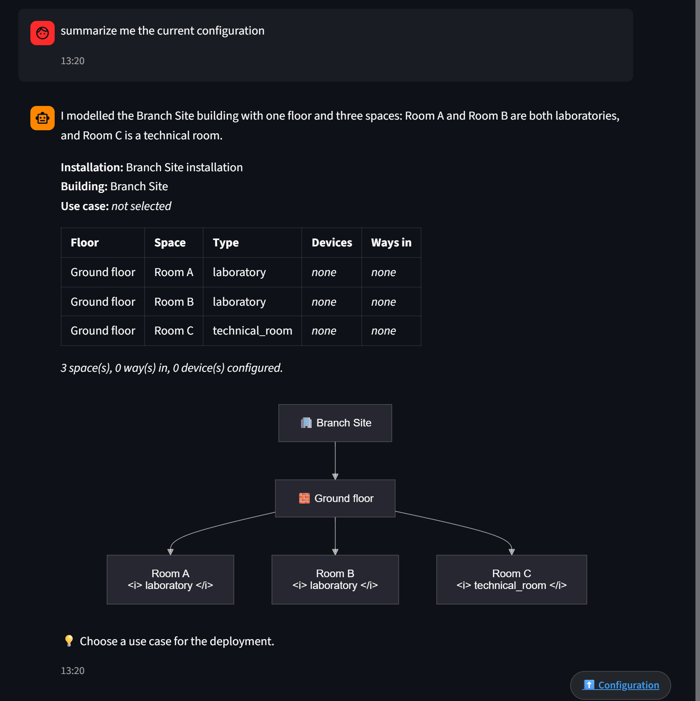
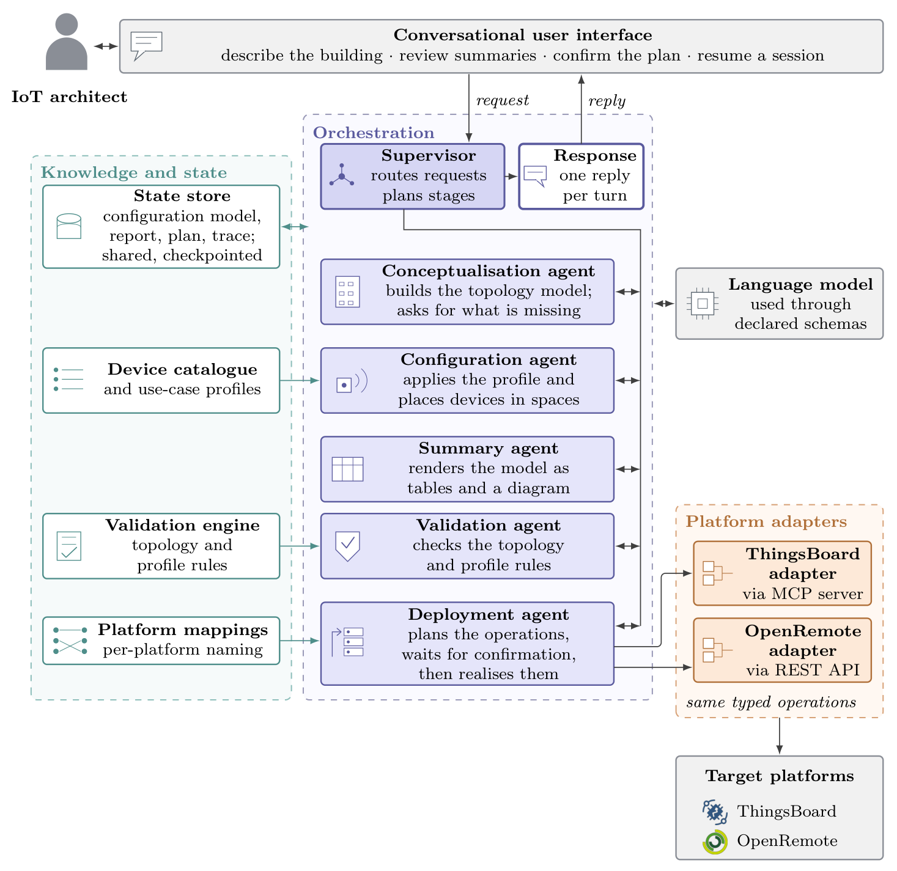

# IoT Agentic Deployer

Artifact of the master's thesis *Agentic AI for the deployment and
configuration of IoT infrastructures* (Damiano Buzzo).

## Scope of the project

The system bridges the semantic gap between an architect's high-level intent,
expressed in natural language, and the low-level provisioning operations
required on an IoT platform. A supervising agent decomposes the activity into
sub-tasks and delegates them to specialised agents, which build a model of the
installation, select devices from a catalogue, validate the result and deploy
it onto the platform the architect chose (ThingsBoard or OpenRemote at the
moment).

What it covers: describing a building in natural language, completing that
description by asking for what is missing, associating catalogue devices with
spaces one at a time or by space type, checking the result against the rules of
the chosen use case, and creating the corresponding entities and relations on a
target platform, with the plan shown and confirmed first.

What it does not: it configures an installation, it does not operate one. It
does not ingest telemetry, run dashboards or manage devices once they have been
provisioned, and it reads back from a platform only to show what it created.

Nothing but deployment needs a platform. The conversation, the model, the
catalogue and the validation all work with nothing running but the app itself,
which is also the quickest way to try it.

The language model is used for what it is reliable at, understanding and
writing language, and for nothing else. It never emits free text where a
structure is expected, it chooses devices from the catalogue rather than from
memory, incompleteness is detected by rules rather than by its judgement, and
whether a configuration may be deployed is decided by code and then confirmed
by the architect.

## What it does

The capabilities of the running prototype, in the order an architect meets
them. Each links to a screenshot of it.

| Capability | Req. | Screenshot |
|---|---|---|
| Describe a building in natural language, in any supported language | R1 | [building description](docs/Images/impl-buildingdescription.png) |
| Complete an incomplete description through questions derived from the rules | R2 | [clarification](docs/Images/impl-clarificationrequest.png) |
| Review the configuration as a table and as a topology diagram | R2 | [summary](docs/Images/impl-summary.png) |
| Consult the catalogue and select a use-case profile | R4 | [catalogue](docs/Images/impl-catalogue.png) |
| Associate devices with one space or with every space of a type | R4 | [assignment](docs/Images/impl-adddevices.png) |
| Check completeness and consistency before deploying | R5 | [validation](docs/Images/impl-validation.png) |
| Review the planned operations and confirm before any write | R5 | [plan](docs/Images/impl-plannedoperations.png), [after confirmation](docs/Images/impl-deployment.png) |
| Deploy onto ThingsBoard or OpenRemote without manual intervention | R6 | [ThingsBoard](docs/Images/impl-thingsboard.png), [OpenRemote](docs/Images/impl-openremote.png) |
| Resume a configuration in a later session | R7 | [sidebar](docs/Images/impl-previousconfigurations.png) |
| Inspect the trace of everything that ran | R7 | [trace](docs/Images/impl-tracebility.png) |



## Structure of the project



The architecture is organised in four layers. The architect talks only to the
**conversational interface**, through which the building is described,
summaries are reviewed, the plan is confirmed and earlier sessions are resumed.
The **orchestration** layer hosts the supervisor, the specialised agents and
the response node, as nodes of one stateful graph. The **knowledge and state**
layer holds what is known: the **state store**, which keeps the configuration
model, the validation report, the plan and the trace, checkpointed across steps
and sessions; the **device catalogue and use-case profiles**; the **validation
engine**, which evaluates the minimal topology rules and the rules of the
active profile; and the **platform mappings**, what each platform calls what
the model holds. The **execution** layer is the platform adapters, which expose
the same typed operations for every target and are the only place that knows
which one it is.

Wherever the **language model** is called, it fills a declared schema: what
comes back is an instance of a Pydantic model, validated on reception, never
prose to be parsed.

The supervisor delegates to five specialised agents: **conceptualisation**
(builds the topology model and asks for what is missing), **configuration**
(applies the profile and places devices in spaces and on their ways in),
**summary** (renders the model as tables and a diagram), **validation**
(checks the topology and profile rules) and **deployment** (plans the
operations, waits for confirmation, then realises them).

A sixth node, **response**, is never delegated to: it runs once the turn is
over and composes everything the turn produced into the single reply the
architect reads, in their language, with the renderings the code built left
untouched. The model writing it is given a closed list of facts about the turn,
and fills only two short fields, what was done and what the architect can do
next, so it has nothing left to invent.

The graph is a star: every agent returns to the supervisor, which is what makes
the workflow cyclic. A failed validation that sends the activity back to
configuration, or a clarification that sends it back to conceptualisation, is
an ordinary routing decision, and the state it returns to is the one the
intervening steps left behind. A message that asks for more than one stage
gets all of them: the supervisor decides the whole sequence once, and the graph
works through it without asking again. Deployment always ends a sequence,
because it suspends on the plan and waits for the architect.

The decomposition follows the three stages of the SAIBA framework, so that what
the installation must achieve is expressed independently of how a platform
realises it:

| SAIBA stage | Components | Produces |
|---|---|---|
| Intent planning | Supervisor, conceptualisation and configuration agents | The platform-agnostic model of the installation |
| Behaviour planning | Validation and summary agents, planning phase of deployment | The model admitted to deployment, and the ordered operations derived from it |
| Behaviour realisation | Realisation phase of deployment, platform adapters | Entities and relations on the target platform |

### Source layout

```
src/iot_agentic_deployer/
  workflow.py        orchestration graph and session API
  agents/            one module per agent, plus response.py
  domain/
    models.py        conceptual model of an installation
    state.py         shared state, trace, routing schema
    validation.py    validation engine
    catalog/         devices.yaml, use_cases.yaml, platform_mappings.yaml, loader
  platforms/
    base.py          adapter contract, operation type, registry
    planning.py      derivation of the deployment plan
    thingsboard.py   adapter over the ThingsBoard MCP server
    openremote.py    adapter over the OpenRemote REST API
    mcp_client.py    MCP session handling
  rendering/         tables and diagrams built from the model
  ui/chat.py         Streamlit interface
```

`domain/` contains no reference to a language model and none to a platform: it
is the part of the artifact whose behaviour is decidable. Everything
platform-specific is confined to `platforms/` and `platform_mappings.yaml`.

Device types, use-case profiles and per-platform naming are declared in YAML
under `domain/catalog/`, and the schemas that bound the model's choices are
built from those files at start-up: supporting new equipment, a new profile or
a new target does not require modifying the source code (R4).

### Requirements coverage

| Req. | Realised by |
|---|---|
| R1 Natural language as the entry point | Constrained extraction into the topology schema (`agents/conceptualization.py`) |
| R2 Guided conceptualisation of the environment | `missing_topology_information` over the topology rules, plus grounding of the extraction in what was said |
| R3 Hierarchical decomposition of the workflow | Supervisor node and the ordered queue of stages (`agents/supervisor.py`, `workflow.py`) |
| R4 Catalogue-driven device selection | `domain/catalog/`: YAML catalogue, profiles and mappings, from which the intent schemas are generated |
| R5 Validation before execution | `domain/validation.py`, re-evaluated inside the deployment node above the interrupt |
| R6 Automated, platform-mediated deployment | `platforms/`: plan, adapter contract, ThingsBoard over MCP, OpenRemote over REST |
| R7 Stateful, resilient and traceable orchestration | SQLite checkpointer, model-derived operation identifiers, `trace` in the shared state |

Deployment is interruptible in the LangGraph sense: the plan suspends the graph
and the architect's reply resumes it. On resumption the node runs again from
its beginning, so validation and planning are repeated against the model as it
stands at that moment: a confirmation authorises a plan, not a session.
Anything other than a plain go-ahead, whether a condition, a question or an
unreadable reply, leaves the platform untouched. Execution stops at the first
refusal, and an interrupted run picks up where it stopped, since operations are
identified by the model rather than by the run, and what already succeeded is
not attempted again (R7).

The second platform is what tests the boundary (R6). The two are not even
driven the same way: ThingsBoard through its official MCP server, OpenRemote,
which publishes none, through its REST API with a Keycloak service user. And
OpenRemote has neither a device entity nor a relation entity: everything is an
asset, and containment is the child's own `parentId`. The plan above the
adapter does not know and does not change, `create_relation` simply updates the
child instead. What each platform calls what the model holds lives in
`platform_mappings.yaml`, in its own file rather than in every catalogue entry,
so a third target does not mean editing them all.

### Technologies

| Technology | Role |
|---|---|
| Python 3.13 | Implementation language |
| LangGraph, with the SQLite checkpointer | Stateful cyclic orchestration, checkpointing and interruption (R3, R5, R7) |
| LangChain | Model client and structured output through function calling (R1) |
| OpenRouter | Provider-agnostic access to the language model |
| Pydantic | Conceptual model and the schemas the model must fill (R1, R2) |
| Streamlit | Conversational interface, session sidebar, configuration panels |
| Mermaid | Client-side rendering of the topology diagram |
| Langfuse | Optional tracing of every turn and every model call |
| Docker Compose | ThingsBoard, its MCP server and OpenRemote as local targets |

## Prerequisites

To run the assistant:

- **Python 3.13+** and [uv](https://docs.astral.sh/uv/). `uv` fetches a
  suitable Python itself if the system one is older.
- **An OpenRouter API key.** Every model call goes through OpenRouter, so one
  key covers all of them.

To deploy onto a platform, additionally:

- **Docker**, with the daemon actually running. On Windows and macOS that means
  Docker Desktop started, not merely installed.
- Roughly **2 GB of free disk** and a working connection: the platform images
  are pulled on first use, and ThingsBoard needs a few minutes to initialise
  its database before it answers.

## Installation

### 1. Get the source

```bash
git clone https://github.com/atomicSteiner/IoTAgenticDeployer.git
cd IoTAgenticDeployer
```

Every command below is run from this directory, which is what the rest of
this section calls the project root.

### 2. Dependencies

```bash
uv sync
```

### 3. Configuration

Copy `.env.example` to `.env` in the project root and fill in the key:

```
OPENAI_API_KEY="sk-or-..."
OPENAI_MODEL="anthropic/claude-haiku-4.5"
```

The variable is called `OPENAI_API_KEY` because the client is the
OpenAI-compatible one. The value is an OpenRouter key and starts with `sk-or-`.

Everything else is optional, and falls back to a working default:

| Variable | Effect |
|---|---|
| `ROUTER_MODEL` | A different model for the supervisor's routing decision alone |
| `RESPONSE_MODEL` | A different model for the single reply the architect reads |
| `THINGSBOARD_MCP_URL` | Overrides `http://localhost:8000/sse` |
| `OPENREMOTE_URL` | Overrides `http://localhost:8080` |
| `OPENREMOTE_AUTH_URL` | Overrides `http://localhost:8081/auth` |
| `OPENREMOTE_REALM` | Overrides `master` |
| `OPENREMOTE_CLIENT_ID`, `OPENREMOTE_CLIENT_SECRET` | Credentials of an OpenRemote service user; required to deploy there |
| `LANGFUSE_PUBLIC_KEY`, `LANGFUSE_SECRET_KEY` | Enable Langfuse tracing; unset, nothing is traced |
| `LANGFUSE_BASE_URL` | Overrides `https://cloud.langfuse.com`, to self-host |

The two model overrides exist because those two calls are the ones a weaker
model handles worst: routing decides who runs, and the reply is the only text
the architect actually reads.

With Langfuse configured, every turn becomes one trace, with each node and each
model call inside it, and all the turns of a conversation are grouped under one
Langfuse session. This is independent of the activity trace
shown in the interface, which is part of the model and is always there.

### 4. Running it

**From the project root**, and only from there:

```bash
uv run streamlit run src/iot_agentic_deployer/main.py
```

The working directory matters. The session database (`iot_agentic.db`) and the
sidebar index (`sessions_index.json`) are created relative to it, so launching
from somewhere else gives a different and empty set of configurations rather
than an error. If earlier work seems to have disappeared, this is why.

### 5. ThingsBoard, only to deploy there

```bash
cd src/iot_agentic_deployer
docker compose up -d
```

ThingsBoard takes a few minutes on first boot; once it responds on
`localhost:9090`, restart the MCP server so it can authenticate:

```bash
docker compose restart mcp-server
```

Credentials: `tenant@thingsboard.org` / `tenant`. Go back to the project root
before starting the app.

### 6. OpenRemote, only to deploy there

```bash
cd src/iot_agentic_deployer
docker compose -f docker-compose.openremote.yaml up -d
```

The manager answers on `localhost:8080` and Keycloak on `localhost:8081`.

In the manager console, in the realm being deployed to (`master` unless
`OPENREMOTE_REALM` says otherwise), create a **service user** and put its
client id and secret in `.env`. Two things have to be right:

- it must be a service account, because the adapter authenticates with the
  client-credentials grant and never with a password;
- it must be allowed to **write** assets, not only to read them. Reading is all
  the reachability check performs, so a read-only service user passes the check
  and then fails on the very first entity, reporting `Interrupted after 0 of N
  operation(s)` with a 403. That is a permissions problem, not a deployment
  bug.

Deployment authenticates before it does anything, so an unreachable or
unauthenticated platform stops the run before a single entity is written.

### 7. A session

Describe the building, choose a use case, assign devices, ask for a validation
check, then ask to deploy. For instance:

1. *The Computer Science Building has a ground floor with two classrooms, an
   office and a technical room.*
2. *Use the wellness profile and add an environmental sensor to every
   classroom.*
3. *Is the configuration ready to be deployed?*
4. *Deploy it on ThingsBoard.*

Deployment shows the operations it would perform and stops there: it writes
nothing until the architect replies in the chat to confirm. Configurations are
kept between sessions and listed in the sidebar.

### Starting over

ThingsBoard keeps its data outside the container, in `~/.mytb-data`, so
`docker compose down` leaves the tenant populated and a repeated deployment
meets the entities the previous one created. That is a legitimate scenario and
the assistant handles it, reusing an existing entity rather than duplicating
it, but for a clean demonstration stop the containers and remove
`~/.mytb-data` and `~/.mytb-logs` first. On the assistant's side, deleting
`iot_agentic.db` and `sessions_index.json` from the project root clears every
stored configuration.
